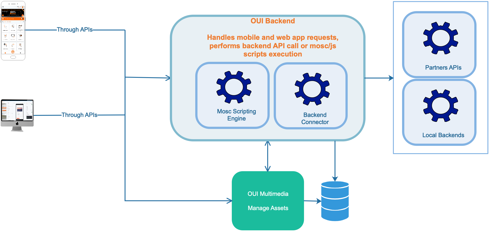

# OUIDesigner Android SDK
The SDK that enables OUIDesigner integration in Android Native projects.

Below OUIDesigner global architecture.

  

# Requirements

This SDK has dependencies on below libraries:
* Google Material for many components
* Glide for SVG image displaying
* RetroFit2 for API calls
* AndroidX
* [MEvento](https://github.com/molobala/mevento-kt) for view logic implementations
* Google Flexbox
* Circleimageview

# How to integrate using Gradle build system

## Repositories
To access OUIDesigner SDK you need to configure gradle by adding theses sources as repositories:

In project build.gradle or settings.gradle

```gradle

repositories {
    maven {
        url = uri "https://raw.githubusercontent.com/molobala/ouid-android/main"
    }
    maven { url 'https://jitpack.io' }
}

```
Jitpack will allow you fetching [MEvento](https://github.com/molobala/mevento-kt) dependancy, since OUIDesigner has dependency on MEvento

## Dependencies

```gradle

dependencies {
    implementation 'com.github.molobala:mevento-kt:1.0.5'
    implementation 'com.ml.labs:oui:1.0.2'
}

```

## SDK Setup

To setup OUIDesigner SDK, you should have acquired an API key from the backoffice with the secret code. Theses credentials are used to setup the SDK:

```kotlin
.....
import com.ml.labs.ouib.OUI


class MainActivity : ComponentActivity() {
    override fun onCreate(savedInstanceState: Bundle?) {
        super.onCreate(savedInstanceState)
        OUI.setup(
            applicationContext,
            backendUrl,
            apiKey,
            secret,
            OUI.UserData("", ""),
            webPackage = "",
            assetsURL = "https://xxx"
        )
    }
}

```

You can enable development mode by setting `OUI.mode`: 

```kotlin
OUI.mode = OUI.OUIMode.development
```

In this mode you can test your services while developing theme without the need to publish them. This mode works only if the apk is in `debug` build config.
## Theming
By default, the SDK will try to pick material theme if available, else it will false on the default theme or the internal theme which is customizable through the SDK.  
Assuming we want to setup the SDK with compose theme, we can proceed like this:

```kotlin
setContent {
    OuiTheme {
        OUITheme.setup(
            theme = OUITheme.INTERNAL_THEME,
            primary = MaterialTheme.colorScheme.primary.toArgb(),
            onPrimary = MaterialTheme.colorScheme.onPrimary.toArgb(),
            secondary = MaterialTheme.colorScheme.secondary.toArgb(),
            onSecondary = MaterialTheme.colorScheme.onSecondary.toArgb(),
            tertiary = MaterialTheme.colorScheme.tertiary.toArgb(),
            onTertiary = MaterialTheme.colorScheme.onTertiary.toArgb(),
            error = MaterialTheme.colorScheme.error.toArgb(),
            onError = MaterialTheme.colorScheme.onError.toArgb(),
            outline = MaterialTheme.colorScheme.onBackground.toArgb(),
            background = MaterialTheme.colorScheme.background.toArgb(),
            onBackground = MaterialTheme.colorScheme.onBackground.toArgb(),
        )
        Greeting(name = "Hi", Modifier.clickable {
            OUICommonHelper.openPage(this@MainActivity, page)
        })
        UIServiceItems(stream!!)
    }
}
```
## Access services

Once the setup done, you can access the OUIDesigner services through the SDK. 

### All services
`OUI` instance exposes a method to fetch all available services: 
```kotlin
val list = OUI.uiServices()
// build a view with the list

```

### LiveData

You can access the `stream` LiveData property on OUI instance which will let you listen to services loading. 

```kotlin
@Composable
fun UIServiceItems() {
    val pages = OUI.stream.observeAsState(initial = emptyList())
    val context = LocalContext.current

    // Use LazyColumn for better performance with large lists
    LazyColumn {
        items(pages.value) { p ->
            ListItem(
                headlineText = {
                    Text(text = p.name)
                },
                trailingContent = {
                    Icon(Icons.Rounded.ArrowForward, contentDescription = null)
                },
                modifier = Modifier.clickable {
                    OUICommonHelper.openPage(context, p)
                }
            )
        }
    }
}
```

Alternativaly, you can call `livedServices` method on `OUI` to get a `LiveData` of a all or a specific group of services identifies by their `Tags`. 

```kotlin
@Composable
fun UIServiceItems() {
    val pages = OUI.livedServices(tags = "HOME").observeAsState(initial = emptyList())
    val context = LocalContext.current

    // Use LazyColumn for better performance with large lists
    LazyColumn {
        items(pages.value) { p ->
            ListItem(
                headlineText = {
                    Text(text = p.name)
                },
                trailingContent = {
                    Icon(Icons.Rounded.ArrowForward, contentDescription = null)
                },
                modifier = Modifier.clickable {
                    OUICommonHelper.openPage(context, p)
                }
            )
        }
    }
}
```
## Building View
Assuming you have an UIPage, you can call the build function of `OUI` to create an android view that you can use as you want in your UI.  

```kotlin
val page = OUI.page("SERVICE_1")
val pageHolder: OUI.OUIPageHolder = OUI.build(
            page,
            requireContext(),
            uiContext, // can be null, in which case a new one is created
            data, // a hashmap
            savedInstanceState,
            OUIPageRender.currentRouter // or pass a custom router
)
pageHolder.view.view() // to get the underlined android view
```

* `OUI.OUIPageHolder`: This class holds data about a freshed builded UIPage
    - `view: OUIView`: The wrapped OUIView
    - `page: UIPage`: The underlined page
    - `context: OUIContext`: The build context

*For the configuration changes to be handled automatically by the SDK, you need to call the `saveState` method of the pageHolder in the `onSaveInstanceState` method of your activity of Fragment, the `restoreState` method is always called automatically by the SDK when rebuilding views*

## Custom Component

The SDK comes with a lot of basic components that allow OUIDesigner developers to build services, if thoses components do not fit you need, you can create your own components for those needs.  

OUIDesigner requires  each component parser to be registered using the method `OUIBuilder.register(c)`. `Component` are plain Android `view`, parsers implement `ViewParser` interface. 

* `ViewParser`: This interface's is responsible for build a component based on its type.
    - `fun parse(map: Map<*,*>, context: OUIContext): OUIView`:  convert UI data to Android View
    - `type: String`: The type of the component this parser can handle

* `OUIView`: This interface is kind of wrapper of Android native View
    - `fun update()`: Called to update the wrapped view
    - `fun view(): View`: Called to return the wrapped view
    - `fun saveState(bundle: Bundle)`: Called to save the internal state of the wrapped view, genenaly during confiruration changes
    - `fun restoreState(saved: Bundle)`: Called to restore the internal state of the wrapped view, generaly after configuration changes

Most of the time you don't need to implement `OUIView` interface, we made things simple by creating an abstract class over `OUIView` that allow you to simply wrap an android view.

### OUIViewHolder
This class is an implementation of `OUIView` allowing developers to wrap easily android views:

In `MyComponentParser.kt` file
```kotlin

class MyComponentParser: ViewParser {
     override fun parse(map: Map<*, *>, context: OUIContext): OUIView  = OUIViewHolder(context) {
        val component = MyView(context.context) // context.context ==> give native android Context
        doOnUpdate {
            component.update()
        }
        component
     }
     override val type = "MyComponent"
}

```

And somewhere in your project, like in your activity `onCreate`, you register the new parser:  

In `MainActivity.kt` file
```kotlin
    class MainActiviy: ComponentActivity() {
        fun onCreate(bundle: Bundle) {
            OUIBuilder.register(MyComponentParser())
        }
    }
```

### State management
To save or restore the native view state holded in OUIView, you can use methodes `saveState` and `restoreState`. If you are using `OUIViewHolder` instead, you can take benefit of the state management system provided by `OUIViewHolder`.

```kotlin

class MyComponentParser: ViewParser {
     override fun parse(map: Map<*, *>, context: OUIContext): OUIView  = OUIViewHolder(context) {
        val internalState = acquireState { // acquire a state with a default value
            map["defaultValue"] as? String
        }
        val component = MyView(context.context) // context.context ==> give native android Context
            .apply {
                value = internalState.value
            }
        doOnUpdate {
            component.update()
        }
        component
     }
     override val type = "MyComponent"
}

```

This way the saving and restoration of state are handled automatically by the SDK.
## ImageView and SVG

The imageview component exposed in OUIDesigner handles view of type images, it uses [de.hdodenhof:circleimageview](https://github.com/hdodenhof/CircleImageView) for avatar type image, [Glide](https://github.com/bumptech/glide) for image loading.  
For OUIDesigner to be able to load svg images, you need to expose an AppGlideModule somewhere in your project.  

```kotlin
@GlideModule
class YourAppGlideModule : AppGlideModule()
```

## Routing
In every application routing aspect is quite unavoidable, in OUIDesigner, routing are handling throught `ORouter` interface which defines bellow methods:
* **`fun push(page: UIPage, params: Any?): CompletableFuture<Any?>?`**: called when OUIDesigner need to navigate forward on new page, generally triggered by `push(page, params)` function from [MEvento](https://github.com/molobala/mevento-kt) script.
* **`fun modal(vm: MEvento?, page: UIPage, params: Any?, options: Map<*, *>?): CompletableFuture<Any?>?`**: caled when OUIDesigner want to display a modal when `modal(page, params)` function is called from [MEvento](https://github.com/molobala/mevento-kt) script.
* **`fun pop(context: Context): Boolean`**: called when `back()` function is triggered from [MEvento](https://github.com/molobala/mevento-kt) script to order OUIDesigner to pop current page.
* **`fun navigateTo(url: String)`**: binded to `navigateTo(url)` function in [MEvento](https://github.com/molobala/mevento-kt) script, it allows internal navigation to a specific page in the application.

The SDK hold a default implementation of ORouter based on fragmentManager called `FragmentRouter`, this router is the default router used by `OUIpageRender` which is it-self the default page renderer in the SDK. In case you don't use `OUIPageRender` (default page renderer), you can set the fallback router through `OUI.router` setter method. 

`OUIPageRender` exposes a setter method allowing to define the appropriate way to construct routers, its signature is like this: `var routerProvider: ((manager: FragmentManager, containerId: Int) -> FragmentRouter)? = null`. That way one can create a custome FragmentRouter, overrides appropriates methods and provide it to the default page renderer easily.

```kotlin

class CustomFragmentRouter(manager: FragmentManager, containerId: Int): FragmentRouter(manager, containerId) {
    override fun pop(context: Context): Boolean {
        Log.i(TAG, "Custom router")
        return false
    }
}

OUIPageRender.routerProvider = {fragmentManager, containerId -> CustomFragmentRouter(fragmentManager, containerId)}

```